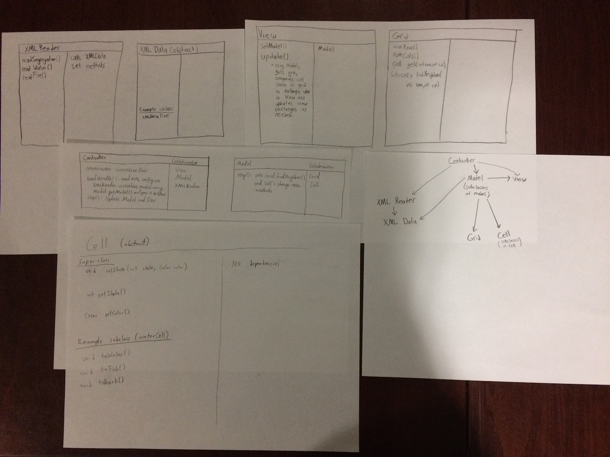
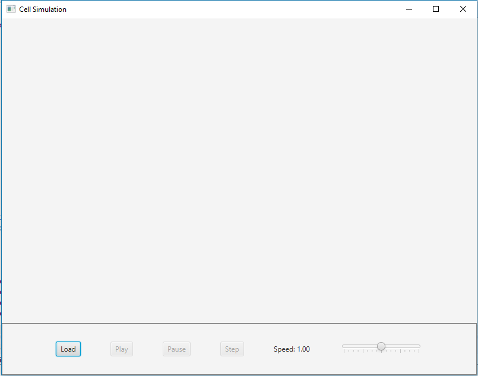

# Cell Society Design
Mike Liu, Bilva Sanaba, Justin Yang

## Introduction
This project implements a cellular automaton visualizer, whose simulation model and starting cell configuration can be specified
by its user. Users will also be allowed to design their own simulation models following the standard of this project and
visualize them with this visualizer. While the user-design model can specify their own rules and cells, the core of this project,
namely the control and display of the visualizer should not need to be modified.

## Overview
* The Controller class sets up the scene and the input panel that interacts with users. It also coordinates the simulation by
loading new simulations with the help of XMLReader and notifying Model and View when to update.
* The Model class is abstract. Each of its concrete subclass implements the logic of one simulation. It gets individual Cells
and find their neighbors with the help of Grid.
* The View class extends Pane and is responsible for displaying the state of the simulation according to the information it gets
from Model.
* The Grid class is abstract. It keeps the 2D information of Cells in a two-dimensional array and is responsible for obtaining
Cells and finding their neighbors based on coordinates given.
* The Cell class is abstract. It only has state and color, but each of its concrete subclass implements methods to create Cells
and change state and color according to the simulation it should be used in.
* The XMLReader class reads the XML configuration file of simulations.
* The essentials of this project, including Controller, Model, View, Grid and Cell are all in cellsociety package. XMLReader will
be in util package. Subclasses of Model will be in the model package, subclasses of Cell will be in the cell package and the
subclasses of Grid will be in the grid package.  

## User Interface
The simulation window will have a horizontal input panel at the bottom with a slider to change the speed of the simulation and
four buttons: Load for loading XML configuration file, Play to start the simulation, Pause to pause the simulation and Step to
step forward through the simulation. The rest of the space in the window will be the grid for simulation. The latter three
buttons will be disabled when no valid configuration has been loaded, and a popup window will show up if user tries to load
invalid configuration.  

## Design Details
* The Controller is the class which updates all aspects of the simulation and is created by the Main method. It first sets up the
scene as a BorderPane with an input panel containing interactable buttons at the bottom as shown by the UI section. It also
creates an instance of View which is included in the scene.  When the load button is pressed an event handler will create an
instance of XMLReader to parse XML configuration file.
* The XMLReader Class takes an XML configuration file structured in a consistent way across all simulations, reads the file, and
can then return a dummy class containing information needed to initialize the simulation, including the type of simulation,
dimension of grid and initial cell configurations. 
* The Controller class obtains the dummy information class from XMLReader and then passes it to a static class in Model to load
the model specified by the XML file with the starting configurations. 
* The Model class is abstract containing an abstract step() method and constructor which creates a stored private Grid class
based on data passed in the dummy classes. Each of its concrete subclass implements the logic of one simulation. In the step
method, it calls Grid.findNeighbors() for each cell and updates it based on this information (on the next iteration for
simultaneous update). In order to add a new simulation, users simply need to create another subclass of Model with the
appropriate set of rules, so this design maximize extensibility.
* The Grid class is an abstract class that simply contains a matrix of the Cell class as well as methods for getting Cells, an
abstract method for determining neighbors of a cell, and for determining the size of the grid. This design makes it easy to
create new grids with different neighbor rules.
* The classes which extend Grid (e.g. rectangleGrid) will have a method that finds neighbors according to context.
* The cell class simply contains information on the state of a cell in int form as well as color. The subclasses of the cell
contain information on what colors will be displayed on that type of cell, as well as update methods to turn the cell to
different state color of that state.
* When Start is clicked, an event handler in controller begins the animation. In each step, the model is updated, which updates
the grid appropriately, and then view is updated, which updates the visual representation of the grid on the screen. 
* The View class extends Pane and is responsible for displaying the state of the simulation according to the information it gets
from Model. In Controller, the View is initialized and will get a instance of Model when the model is loaded. In its constructor,
View takes model and adds visual representations of the Model¡¯s grid to View¡¯s children, which will be displayed on the screen.
When View is updated, it simply loops through its Model¡¯s grid and updates its representation of the grid. 
* The simulation continues until pause is pressed. An event handler in Controller pauses the timeline. If load is pressed,
timeline is stopped, view is cleared and both View and Controller will get the newly loaded Model. If the speed slider is moved,
an event handler sets the step delay accordingly.
* For extendability, any model that displays a similar grid can be created by making a new Cell class with appropriate colors
and update methods, and a Model subclass with an appropriate step method. This would not require changing anything else.

### Use Cases
* For a middle cell in Game of Life, in the Grid class, the findNeighbors method is called. This will use the coordinates of the
middle cell and determine that it is not on the edge or corner by checking if its coordinates are the max or min possible. Once
the method finds that it is a middle cell, the findNeighbors will find the 8 neighbors and return them as a Set<Cell>. This
method would be called in GameOfLifeModel. From here, inside step(), the model would count the neighbors and update the cell to
the dead state if there were less than three neighbors with non dead states (state according to the gameOfLifeCell class). This
all occurs inside a loop that does this with each cell. Additionally, all of this occurs in the Controller¡¯s step method. In
this step method, view.update() is also called which takes the just  updated grid with cell states and then updates the visual
representation of the cells. 
* This would work the same as above. In the findNeighbors method, if the cell was on the edge, the method would determine based
on coordinates, and not store/check for the inexistent cells in the returned set of cell neighbors. 
* As stated in the first use case, the updates for each cell occur in the step function for Controller. In the Model.update,
the grid¡¯s cells are updated. After this, view.update() is called which will take the new grid, compare it to its current state,
and change the views of any non-matching cells. 
* XMLReader parses all the information from the XML file and saves it in XMLData according to the tags. XMLData is passed to
Model, which calls a get method to retrieve propCatch from the XMLData instance and then sets the parameter.
* To change the current simulation from Game of Life to Wa-Tor from the GUI, load the XML file corresponding to the Wa-Tor
simulation. Controller will use an XMLReader instance to read the XML file and create a new XMLData class containing the initial configuration and model title. Controller will then create a new Model subclass for the specific simulation and pass the XMLData to a static method to initialize the Grid instance within the Model. The simulation runs when start is pressed.

## Design Considerations
* Several designs have been considered as of how the display should interact with the backend logic of the game and where the
timeline should be placed. Originally, we decided to put all visual components in View and backend logic in Model, which
contains the timeline and make View interact with the timeline via Model when the buttons are pressed. However, later we decided
to make Controller set up the window including the user input panel and leave the display of the simulation to the View class.
Controller also keeps the animation timeline so that it can synchronize Model and View conveniently. The View class keeps an
instance of Model but only uses it when repainting the simulation.
* Model, Grid and Cell are abstract classes, so that they can be extended easily. To create a customized simulation, the user
just need to create a new subclass of Model that specifies the rules of the simulation and a corresponding subclass of Cell with
method names understandable in the context (users can also other concrete subclasses of Cell but the name of the methods will
hardly be meaningful). If users want to create grids with different shapes or neighbors rules, they can also just implement a
new subclass of Grid.
* Methods in different subclasses of Cell have different names but perform essentially very similar tasks. Although the code in
those methods might be somewhat repetitive across classes, we think this is the best way to allow our users to create cells with
as many states as they need and help them keep track of the states.

## Team Responsibilities
* Mike Liu  
Primary: Design the structure of classes in the project, implement Controller, View and the Model subclass for game of life
simulation  
Secondary: Check XMLReader and subclasses of Model to ensure they are implemented correctly
* Bilva Sanaba  
Primary: Implement Model subclasses for segregation and predator-prey simulation and Grid class  
Secondary: Ensure Controller uses Model and Model uses cell appropriately
* Justin Yang  
Primary: Implement XMLReader class, XMLData class/subclasses, and cell subclasses  
Secondary: Ensure that Controller uses XMLReader and Model uses XMLData correctly